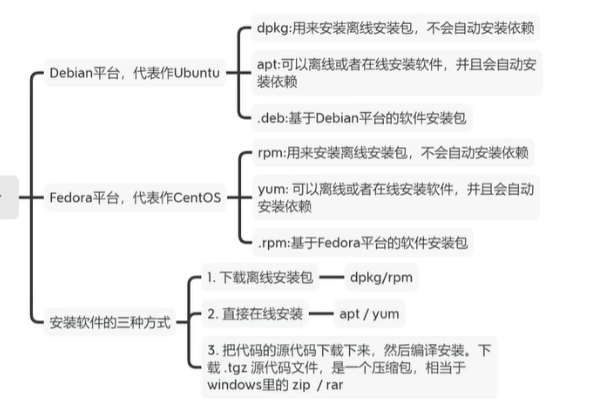

# Linux基础

## 系统常用命令

```shell
# bg: 把任务放到后台
# fg: 把后台任务放到前台
# eval: 读入参数,并将它们组合成一个新的命令,然后执行
# export: 设置或显示环境变量
```

### 环境变量

```shell
bashrc与profile都用于保存用户的环境信息

bashrc用于交互式non-loginshell
profile用于交互式login shell

/etc/profile,/etc/bashrc 是系统全局环境变量设定
~/.profile,~/.bashrc用户目录下的私有环境变量设定
```

### 程序构建

```shell
# 一般源代码提供的程序安装需要通过配置,编译,安装三个步骤

# 配置: 检查当前环境是否满足要安装软件的依赖关系,以及设置程序安装所需要的初始化信息,比如安装路径,需要安装哪些组件.配置完成,会生成makefile文件供第二步make使用
# 编译: 对源文件进行编译链接生成可执行程序
# 安装: 将生成的可执行文件拷贝到配置时设置的初始路径下

# 查询可用的配置选项
./configure --help

# 编译使用make编译
# make -f myMakefile
make

# 安装
make install
```

### 显示或设置系统的主机名

```shell
# 临时修改为test
hostname test
# -i 显示主机所有IP地址,不依赖DNS解析

# 永久修改
vim /etc/hostname

# centos7临时又永久修改
# hostnamectl 修改主机名称
hostnamectl set-hostname crab
```

### 查看系统版本

```shell
cat /etc/redhat-release
```

### DNS映射文件

```shell
cat /etc/hosts
```

### 磁盘挂载文件

```shell
# 实现储存设备开启自动挂载的配置文件
# cat /etc/fstab
UUID=1114fe9e-2309-4580-b183-d778e6d97397 /mount1 xfs defaults 0 0
要挂载的磁盘文件  挂载点  指定文件系统类型 挂载参数 是否备份磁盘 是否检查磁盘
```

### 开机服务自启配置文件

```shell
# 文件中的内容会在系统启动后加载, 必须是命令
cat /etc/rc.local

# systemctl start sshd

# centos7需要权限,才能实现开机服务自启
chmod +x /etc/rc.d/rc.local
```

### 系统的运行级别

```shell
centos 6
00 系统的关机级别, 进入到关机状态

centos 7(启动级别:target)
00 系统的关机级别进入到救援模式
01 系统的单用户模式, 用于修复系统或重置密码信息, 没有网络
02 系统的多用户模式, 没有网络
03 系统的多用户模式, 正常系统运行级别, 有网络
04 预留级别
05 图形化界面级别
06 系统的重启级别

# 输出当前运行级别
runlevel
# N 3

# 临时调整, 设置系统运行级别
init 3

# 永久调整
# 1. centos 6
# cat /etc/inittab

# 2. centos 7
# 获取当前系统运行级别
systemctl get-default
# 设置
systemctl set-default multi-user.target

# 查看所有级别
ls -l /usr/lib/systemd/system/runlevel*target
```

### 操作系统环境变量

```shell
# 1. 临时修改系统环境变量
PATH=$PATH:/crab

# 2. 永久设置
# vi /etc/profile, 需要重启或者加载才生效
# export 定义系统环境变量
export PATH=$PAT:/crab

# source 立即加载文件配置信息
source /etc/profile
```

### 设置别名

```shell
# 查看当前所有别名
alias

# 临时设置别名
alias ll='ls -l'

# 取消别名
unalias ll

# 使别名失效, rm为设置的别名 alias rm='echo no delete'
\rm -rf /crab

# 别名永久生效, 写入环境变量
# /etc/profile == /etc/bashrc
# ~/.bashrc == ~/.base_profile
```

### 查看命令是否是内置命令

```shell
type cd
```

### 登录前后提示文件

```shell
# 输入 hi,crab, 登录之后显示该信息
cat /etc/motd

# 登录之前提示信息
# /etc/issue /etc/issue.net
```

### yum: 自动化RPM包管理工具

```shell
# 本地配置yum源
cd /etc/yum.repos.d
# 更新
curl -o /etc/yum.repos.d/CentOS-Base.repo https://mirrors.aliyun.com/repo/Centos-7.repo

# -y 确认

# 列出所有安装包
yum list installed

# 检查更新
yum check-update

# 安装
yum install httpd

# 卸载
yum remove httpd

# 更新
yum update httpd

# 列出软件包
yum list httpd

# 搜索
yum search httpd

# 列出所有可用软件
yum list

# 更新系统
yum update

# 列出启用yum源
yum repolist

# 列出所有yum源
yum repolist all

# 清理所有缓存
yum clean all

# 历史
yum history

# 查找命令属于哪个大礼包
yum provides locate

# 删除软件, 不推荐, 可能会删除依赖软件
# yum erase 软件
# 推荐
# rpm -e 软件 --nodeps
```

### rpm: RPM包管理器



```shell
# -q 查询
# -i info|install
# -l 显示软件包中的所有文件列表
# -R 显示软件包的依赖环境
# -v 详细信息
# -h 显示安装进度
# -a 查询所有软件包
# -e 卸载
# -f 查询文件或者命令属于哪个软件包

# 查询mysql相关
rpm -qa|grep mysql

# 安装
rpm -ivh a.rpm

# 查看文件属于哪个软件包
rpm -qf /usr/bin/ssh
rpm -fq `which ssh`
```

### 日志文件保存目录

```shell
ll /var/log/
# messages 记录系统或服务程序运行的状态信息和错误信息
# secure 用户登录信息
```

### 系统硬件信息查看方法

```shell
# 1. 查看cup
cat /proc/cpuinfo
# 2.
lscpu

# 1. 查看内存
cat /proc/meminfo
# 2
free

# 1. 查看磁盘/挂载信息
cat /proc/mounts
# 2.
df

# 1. 查看负载(cpu处理任务过多)
cat /proc/loadavg
# 1分钟平均负载 5分钟 15分钟
# 2
w
```

### uname: 显示系统信息

```shell
# -r 显示内核发行版本号
uname -r

# 显示操作系统
uname -m

# -a 显示系统所有相关信息
uname -a
lsb_release -a
```

### 防火墙

```shell
# centos7查看防火墙状态
systemctl status firewalld
# centos6
/etc/init.d/iptables status

# centos7 临时关闭防火墙
systemctl stop firewalld
# centos6
/etc/init.d/iptables stop

# centos7永久关闭防火墙, 禁止开机启动
systemctl disable firewalld
# contos6
chkconfig iptables off
```

### 系统的selinux服务程序

```shell
# selinux服务对root用户权限进行控制, 一般关闭
# 6==7

# 状态查看
getenforce

# setenforce Enforcing/1 临时开启selinux
# setenforce Permissive/0 临时关闭selinux

# 永久修改
# vi /etc/selinux/config
SELINUX=disabled
```

### 字符编码优化

```shell
# 查看
echo $LANG

# 1. 临时修改
LANG=en_US.UTF-8

# 2. 永久修改
# vi /etc/profile
# export LANG=en_US.UTF-8
source /etc/profile

# 2.1 centos6永久修改
# vi /etc/sysconfig/il8n
LANG='en_US.UTF-8'

# 2.2 centos7永久修改
# vi /etc/locale.conf
# 一条命令既永久又临时
localectl set-locale LANG=zh_CN.GBK
```

### 修改网卡配置文件中网卡名称信息

```shell
# 1. 编辑
# vim /etc/sysconfig/network-scripts/ifcfg-ens33
NAME=eth0
DEVICE=eth0

# 2.重命名
mv ifcfg-ens33 ifcfg-eth0

# 3. 修改网卡名称规则内核文件
vim /etc/default/grub
# GRUB_CMDLINE_LINUX列添加信息 net.ifnames=0 biosdevname=0

# 4.使系统重新加载grub配置文件
grub2-mkconfig -o /boot/grub2/grub.cfg
```

### ln: 硬连接和软连接

```shell
# 软链接相当于快捷方式,硬链接相当于复制一份

# 无参数,创建硬链接

# -s 创建软链接(符号链接)
ln 源文件 目标文件
```

### locate: 快速定位文件路径

```shell
# locate会为文件系统建立索引数据库,如果有文件更新,需要定期更新索引库

yum install -y mlocate

# 第一步需要更新数据库
updatedb

# 寻找包含有string的路径
locate string
```

### find: 查找文件

```shell
# -maxdepth 层级
# -inum inode信息
# -delete 找到后删除
# -exec 找到文件作相应处理, 每个文件分别处理
# -perm 通过权限查找
# -iname 忽略大小写
# -mtime +10 10天前的文件(10前面第10天, -10:最近10天)
# -type 文件类型 f代表文件 d代表文件夹 l代表链接
# -maxdepth levels 查找级数
# find 找寻的路径范围 -type 类型信息 -name '文件名称'
find . -maxdepth 1 -type f -size +1M -name '*.gz'

# 查看当前目录下文件个数
find ./ | wc -l
16649

# -o or
# 查找txt和pdf文件
find . \( -name "*.txt" -o -name "*.pdf" \) -print

# 查找所有非txt文本
find . ! -name "*.txt" -print

# -atime 访问时间,单位是天.分钟单位则是-amin
# -ctime 变化时间,元数据或权限变化
# -mtime [-n|+n|n] 通过文件修改时间
# 查询7天前被访问过的所有文件
find . -atime +7 -type f -print

# 寻找大于2k的文件
find . -type f -size +2k

# 查询具有可执行权限的所有文件
find . -type f -perm 644 -print

# 用户weber所拥有的文件
find . -type f -user weber -print

# 找到之后删除当前目录下所有的swp文件
find . -type f -name "*.swp" -delete

# {}是一个特殊的字符串,对于每一个匹配的文件,{}会被替换成相应的文件名
# 将找到的文件全都copy到另一个目录
find . -type f -mtime +10 -name "*.txt" -exec cp {} OLD \;

# 递归当前目录及子目录删除所有.ooo文件
find ./ -name "*.ooo" -exec rm {} \;
```

### tree: 树结构显示目录下内容

```shell
yum -y install tree

# -d 只显示目录
# -L 遍历目录的最大层数
tree -L 2 -d /root
```

### tar: 打包备份

```shell
# z 通过gzip压缩或者解压
# c 创建新的tar包
# x 解开tar包
# v 显示过程
# f 指定压缩文件的名字
# t 不解压查看tar包内容
# C 指定解压的目录路径
# --exclude=PATTERN 打包时排除不需要的文件或目录
# -h 打包软连接文件指向的真实源文件
# --exclude-from=文件, 文件内指定要排除文件

# 打包
# crab/
# ├── aaa.txt
# └── crab.txt
# 要么全相对路径, 要么全绝对路径
tar -zcvf crab.tar.gz ./crab --exclude=./crab/aaa.txt

# 不解包查看
tar -tf crab.tar.gz
# ./crab/
# ./crab/crab.txt

# 解包
tar -zxvf crab.tar.gz
```

### stat: 查看文件时间属性信息

```shell
stat crab.txt
# atime 文件访问时间信息
# mtime 文件修改时间信息
# ctime 文件变化时间信息(包括属性修改)
```

### date: 显示与设置系统时间

```shell
date "+%F %T"

# -s 设置系统时间
date -s "2020/04/17 14:00"

# -d 显示指定字符串的时间
# 2天后时间
date -d "+2day"

# 时间同步方法
yum -y install ntpdate
ntpdate ntp1.aliyun.com
```

### xargs: 将标准输入转换成命令行参数

```shell
# -d 自定义分隔符
# -n 指定每行显示的字段数
# -i {}代替前面的结果

# 当前目录下所有.log文件移动到dir1下
find . -name "*.log" | xargs -i mv {} dir1/

# 将多行输出转化为单行输出
cat result.txt | xargs
envs my_blog my_blog.log my_blog_sql hhhhh

# 将单行转化为多行输出
cat result.txt | xargs -n 2
envs my_blog
my_blog.log my_blog_sql
hhhhh
```

### 标准输出重定向

```shell
# 将标准输出和标准错误重定向到同一文件
ls /home >> result.txt 2>&1
# ls /usr &>>result.tx
```

### echo扩展

```shell
echo -e "crab1\ncrab2\ncrab3"
```

### grep: 文本过滤工具

```shell
# -v 过滤
# -n 显示行号
# -i 不区分大小写
# -c 统计匹配的行数
# -e 匹配多个
# -E 使用扩展的egrep命令
# -o 只输出匹配内容
# -r 递归查找

# 过滤空行和注释行
grep -Ev "^$|#" nginx.conf
```

### sed: 字符流编辑工具

```shell
# 逐行修改

# p print 输出信息
# i insert 指定信息前面插入
# a append 后面
# d 删除匹配行

# -n 取消默认输出
# -i 直接修改文件内容,默认替换后,输出替换后的内容
# -r 扩展正则

# 打印相关内容
sed -n '/aaa/p' a.txt

# 替换
sed -i 's/hhh/new/g' result.txt

# 输出从aaa到ddd内容, 连续
sed -n '/aaa/,/ddd/p' a.txt

# 输出aaa和ddd行内容, 不连续
sed -n '/aaa/p;/ddd/p' a.txt

# 输出第1-3行
sed -n '1,3p' a.txt

# 最后一行添加信息
sed -i '$a107, eee' a.txt

# 第三行前面添加信息
sed -i '3i1011, CCC' a.txt

# 备份再修改
sed -i.bak '3i1011, CCC' a.txt
# -ni 参数同时使用会清空文件内容, 禁用

# c 替换整行内容
sed '2c bbb' a.txt

# -e 修改多次
# aaa行前面添加行222, 后面添加333
sed -e '/aaa/a333' -e '/aaa/i222' a.txt

# 批量创建用户
echo crab{0..10}| xargs -n 1| sed -r 's#(.*)#useradd \1#g'|bash

# 批量创建用户并添加密码
seq -w 10 | sed -r 's#(.*)#useradd crab\1; echo 123456|passwd --stdin crab\1#g'|bash

# 批量修改文件后缀名
ls crab*.txt| sed -r 's/(.*).txt/mv & \1.jpg/g'|bash

# rename命令
# rename 文件名称需要修改部分 修改为 要修改的文件
rename .jpg .txt crab*.jpg

# 删除第二到第五行
sed '2,5d' result.txt

# 删除第二,第五行
sed '2d;5d' result.txt

# 移除空白行
sed '/^$/d' a.txt
sed -n '/^$/!p' a.txt
sed -n '/./p' a.txt

# 打印匹配行的下一行
sed -n '/case/{n;p}' a.sh
# 替换
sed  '/case/{n;s/1/2/}' a.sh

# -h 模式空间的内容重定向到暂存区
# -H 追加
# -g 取出暂存缓冲区的内容,复制到模式空间
# -G 取出暂存缓冲区的内容,追加到模式空间

# 最后一行替换为第一行
sed '1h;$g' a.sh

# 第一行删除,然后追加到最后一行
sed -r '1{h;d};$G' a.sh
```

### awk: 数据流处理工具

```shell
# 按行处理
# 特殊变量`NR NF $0 $1 $2`
# NR: 当前行号
# NF: 字段数
# $0: 整行内容
# $1: 第一个字段的文本内容
# $2: 第二个字段的文本内容
# $NF: 最后一列
# 行号小于5, <=
awk 'NR < 5' result.txt

# 第二行
awk 'NR==2' b.txt

# 第2-4
 awk 'NR==2,NR==4' b.txt

# 第二, 第四
awk 'NR==2;NR==4' b.txt

# 按照字符查询
awk '/111/;/222/' b.txt

# 显示指定行的第1,2段, 空格分隔
awk '/111/{print $1,$2}' b.txt
# 逗号分隔
awk '/111/{print $1","$2}' b.txt

# 使用-F来设置定界符(默认为空格)
# 获取最后一列中的:分隔信息
awk '/crab/{print $NF}' b.txt |awk -F ":" '{print$3}'

# 不同分隔符,+表示分隔符连续的话视为一个
awk -F '[: ]+' '/crab/{print $1,$2,$(NF-1)}'  b.txt

# 匹配第2列以car开头的信息
awk '$2~/^carb/{print $1,$2,$3}' b.txt

# 第3列中以2,5结尾的信息, column: 对齐
awk '$3~/2$|5$/{print $1,$2}' b.txt |column -t
awk '$3~/[25]$/{print $1,$2}' b.txt |column -t

# 找出并替换输出
# gsub(/要替换的内容/, "替换为", 修改哪列)
awk '$3~/111$/{gsub(/:/,"$", $3);print $3}' b.txt

# 排除空行和注释
awk '!/^#|^$/' b.txt

-v变量=值
awk -vcrab=hi '{print crab}' b.txt

# 特殊模式
awk ' BEGIN{ statements } statements2 END{ statements } '
# 1.执行begin中语句块
# 2.从文件或stdin中读入一行,然后执行statements2,重复这个过程,直到文件全部被读取完毕
# 3.执行end语句块

# 统计系统中有多少个普通用户
awk '$NF~/bash/{i++}END{print i}'  /etc/passwd
# 虚拟用户, 非普通用户
awk '$NF!~/bash/{i++}END{print i}'  /etc/passwd

# 统计冒号分隔, 第一次和3
awk -F':' 'BEGIN{print"第一次","第三次"} {sum=$2+sum;sum2=$4+sum2}END{print sum, sum2}' b.txt | column -t

# 使用不带参数的print时,会打印当前行
echo -e "line1\nline2" | awk 'BEGIN{print "start"} {print } END{ print "End" }'
start
line1
line2
End

echo -e "line1 f2 f3\n line2 \n line 3" | awk '{print NR":"$0"-"$1"-"$2}'
1:line1 f2 f3-line1-f2
2: line2 -line2-
3: line 3-line-3

# 统计文件的行数
awk 'END {print NR}' result.txt
8

# 累加每一行的第一个字段
echo -e "1\n 2\n 3\n 4\n" | awk 'BEGIN{num = 0 ;print "begin";} {sum += $1;} END {print "=="; print sum }'
begin
==
10

# 传递外部变量
var=1000
echo | awk '{print vara}' vara=$var
1000

# 包含new的行
awk '/new/' result.txt
newhh
newhh

# 不包含new的行
awk '!/new/' result.txt
envs
my_blog
my_blog.log
my_blog_sql
123

# 以下字符串,打印出其中的时间串
echo '2015_04_02 20:20:08: mysqli connect failed, please check connect info'|awk -F':' '{print $1 ":" $2 ":" $3; }'
2015_04_02 20:20:08

# 打印指定列
ls -lrt | awk '{print $6}'
Dec
Oct
Oct
Mar

# 使用awk和chkconfig关闭不需要的开机自启服务
chkconfig --list|grep 3:on|grep -vE "crond|sshd|network|rsyslog|stsstat|" | awk '{print "chkconfig " $1 " off"}'|bash

# 修改读入和输出分隔符
awk 'BEGIN(FS=":";OFS="--")
```

### 远程传输软件

```shell
yum install -y lrzsz
```

### umask: 显示或设置权限掩码

```shell
umask
# 0022

# 临时修改
umask 033

# 永久修改
vi /etc/profile
# else
#     umask 022 #修改


# 默认文件权限
666 - 022 = 644
# umask值为奇数 666-033=633+11=644

# 默认路径权限
777 - 022 = 755
# umask值为奇数 777-033=744
```

### chown: 改变文件或者目录的用户和用户组

```shell
# -R 递归改变
# chown 用户:组 test.py
chown -R mysql.mysql /root/mysql/*
```

### chmod: 改变文件或目录权限

```shell
# -R 递归改变
chmod 753 test.py

# 增加脚本可执行权限
chmod a+x test.py

# chmod userMark(+|-)PermissionsMark

# userMark取值
# u 用户
# g 组
# o 其它用户
# a 所有用户

# PermissionsMark取值
# r 读
# w 写
# x 执行
```

### chgrp: 更改文件用户组

### 系统中的一个特殊目录: /etc/skel

```shell
# 样板房: 创建用户时创建跟它一样的家目录
[root@crab tmp]# ll /etc/skel -a
total 20
drwxr-xr-x.  2 root root 4096 Nov 10 10:39 .
drwxr-xr-x. 80 root root 4096 Nov 13 16:57 ..
-rw-r--r--   1 root root   18 Apr  1  2020 .bash_logout # 当系统退出登录状态会执行的命令
-rw-r--r--   1 root root  193 Apr  1  2020 .bash_profile # 别名和环境变量(只针对某个用户)
-rw-r--r--   1 root root  231 Apr  1  2020 .bashrc # 别名和环境变量(全局)
```

### userdel: 删除用户

```shell
# -f 强制删除用户，即使用户已登录
# -r 同时删除与用户相关的所有文件, 建议
```

### useradd: 创建用户

```shell
# -g 指定用户对应的用户组,组需已存在
# -s shell 用户登入后使用的shell名称
# -M 不建立用户家目录
# -u 指定用户uid信息 -u 2000
# -G 指定用户所属的附属组 -G crab1
# -c 添加指定用户注释信息
useradd crab -s /bin/bash -u 1688 -c 'crab!'
useradd crab01 -M -s /sbin/nologin -g crab
```

### 修改当前用户密码

```shell
passwd

# 修改指定用户密码
# passwd 用户名
# echo 123|passwd --stdin
```

### 用户相关命令

```shell
# su - 用户名 切换的同时将登录后的环境变量一并切换

# 查看用户是否存在, su也可
id crab

# whoami: 显示当前登录的用户名

# who: 显示已登录用户信息

# users: 显示已登录用户
```

### 命令提示符

```shell
echo $PS1
# [\u@\h \W]\$
# 修改命令提示符
vi /etc/profile
# \H 显示完整名称
export PS1='[\u@\H \W]\$ '

# linux系统中给信息加颜色
export PS1='\[\e[32;1m\][\u@\H \W]\$ \[\e[0m\]'
```

### usermod: 修改用户信息

```shell
# -s 修改用户登录方式
# -g 修改用户的主要组信息
# -G 修改用户的附属组
# -c 修改用户注释信息
```

### groupadd: 创建新的用户组

### groupdel: 删除用户组

### groups: 用户分组

```shell
# 查看用户分组
groups jack
```

### gpasswd: 添加用户到分组

```shell
# 添加用户jack到分组mike
gpasswd -a jack mike

# 从mike分组剔除jack
gpasswd -d jack mike
```

### chage: 修改用户密码有效期

### chpasswd: 批量更新用户密码

### visudo: 编辑sudoers文件

```shell
# visudo == vi /etc/sudoers
# 添加管理用户
# visudo
test ALL=(ALL) /usr/sbin/useradd,/usr/sbin/userdel

# 检查用户是否拥有root权限
sudo -l
```

### sudo: 以另一个用户身份执行命令

```shell
# 查看当前用户被授予的sudo权限集合
sudo -l
```

### last: 显示用户登录列表

### lastb: 显示用户登录失败的记录

### lastlog: 显示所有用户的最近登录记录

### 定时任务crontab

```sh
# 系统自带
# /etc/cron.daily
# /etc/cron.weekly
# /etc/cron.hourly
# /etc/cron.monthly

# /etc/cron.deny 定时任务黑名单
# /var/log/cron 定时任务服务运行记录日志文件
# /var/spool/cron/ 定时任务配置文件保存目录
# /var/spool/cron/root root用户设置的定时任务配置文件
systemctl status crond

# 查看帮助
cat /etc/crontab

# 定时任务执行时输出到屏幕的信息(占用block)
# /var/spool/mail/root

# 不想要可以关闭邮件服务
systemctl status posfix
# 邮件服务停止后, 会在 /var/spool/postfix/maildrop/ 产生大量小文件(占用inode)
# 优化: 定时任务输出到黑洞 * * * * * sh t.sh &>/dev/null

# 创建.sh文件
#!/bin/sh
/home/bmnars/spider_porject/spider_venv/bin/python /home/bmnars/spider_porject/biotech_org_spider/biotech_org_spider_mysql.py >>/home/bmnars/spider_porject/biotech_org_spider/log/$(date +%Y-%m-%d).log 2>&1

# 设置定时任务
crontal -e
#每天4点执行脚本
0 16 * * * sh /home/bmnars/spider_porject/crontab/biotech_org_spider.sh

# 使用Python虚拟环境,所以执行路径为虚拟环境的Python路径/home/bmnars/spider_porject/spider_venv/bin/python
# 字符%是一个可被crontab识别的换行符所以通过调用.sh文件执行Python脚本(或者转义)
```

### 系统磁盘管理

```shell
系统启动引导记录
  mbr, 用于引导磁盘空间小于2t
  gpt, 大于2t

分区方式
  情况1:
    最多可以划分4个主分区 /dev/sda1..sda4
  情况2:
    3个主分区/dev/sad1..sda3
    1个扩展分区(无法直接使用, 通过逻辑分区) /dev/sda5..sda6


fdisk: 磁盘分区工具
受mbr分区表的限制,fdisk工具只能给小于2TB的磁盘划分分区
centos7 可以2t以上
# -l 显示所有磁盘分区的信息


parted: 磁盘分区工具(立即生效)
# centos6 2t以上
# -l 显示所有磁盘分区的信息


mkfs: 创建Linux文件系统
# -t 指定要创建的文件体统类型
mkfs -t xfs /dev/sdb2
# xfs centos7 格式效率较高


partprobe: 更新内核的磁盘分区表信息


blkid: 系统设备信息查询


实践1, 磁盘小于2T:
# 1. 插入新硬盘
# 2. 找到
ll /dev/sdb
# 3. 分区
fdisk /dev/sdb
# 4. 格式化
mkfs.xfs /def/sdb1
# 5. 更新内核的磁盘分区表信息
partprobe /dev/sdb
# 6. 挂载
mount /dev/sdb1/mnt

开机自动挂载
方法一: 将挂载命令放入/etc/rc.local(检查执行权限
)
mount /dev/sdb1 /mount01

方法二: 写入 /etc/fstab
UUID=1114fe9e-2309-4580-b183-d778e6d97397 /mount1 xfs defaults 0 0
# 要挂载的磁盘文件  挂载点  指定文件系统类型 挂载参数 是否备份磁盘 是否检查磁盘


实践2, 磁盘大于2T:
# 1. 创建分区表
mkpart gpt
# 2. 分区
mkpart primary 0 2100G
# 格式化, 更新, 挂载


调整swap分区大小
mkswap: 创建交换分区
swapon: 激活交换分区
swapoff: 关闭交换分区

# 1. 分出一部分空间
dd if=/dev/zero of=/tmp/1G bs=100M count=10
# 2. 指定为swap空间
mkswap /tmp/1G
# 3. 激活
swapon /tmp/1G
# 4. 关闭
swapoff /tmp/1G


tune2fs: 调整ext2/ext3/ext4文件系统参数


dumpe2fs: 导出ext2/ext3/ext4文件系统信息


resize2fs: 调整ext2/ext3/ext4文件系统大小


fsck: 检查并修复Linux文件系统
# 文件系统必须是卸载的,不要对正常的分区使用fsck
```

### dd: 转换或复制文件

```shell
# if=<输入文件> 从指定文件中读取
# of=<输出文件> 写入到指定文件
# bs=<字节数> 一次读写的字节数
# count=<块数> 指定复制block块的个数
# 从黑洞读取100M到tmp目录下
dd if=/dev/zero of=/tmp/100M bs=10M count=10
```

### mount: 挂载文件系统

```shell
# -o 后接一些挂载的选项,是安全性能优化的重要选项
# -o ro 只读
# -t 指定挂载的文件系统类型

# 查看当前挂载信息
mount

# 找到需要挂载的设备
ls -l /dev

# mount 挂载设备文件信息 挂载点(目录信息)
mount /dev/cdrom /mnt
```

### umount: 卸载文件系统

```shell
# -f 强制卸载
# -l 懒惰卸载不用退出挂载目录卸载, 清除对文件系统的所有引用,一般和-f参数配合使用
umount /mnt
```

### df: 报告文件系统磁盘空间的使用情况

```shell
# -h 人性化显示
df -h

# 文件系统的inode数限制
df -i
```

sync: 刷新文件系统缓冲区

du: 统计磁盘空间使用情况

```shell
# -h 可读方式查看
# -s 递归
du -sh

# 查看当前目录下所有子文件夹排序后的大小
du -sh `ls` | sort -n
```

### 优化打开文件数

```shell
# 查看
ulimit -a

# 修改
echo '*  -   nofile   1024' >>/etc/security/limits.conf
source /etc/security/limits.conf
```

### scp: 远程文件复制

```shell
# -P port 端口
# -p 传输后保留文件原始属性
# -r 递归复制整个目录

# 将本地localpath指向的文件上传到远程主机的path路径
scp localpath ID@host:path
scp -rp ./testc root@121.196.202.188:/tmp

# 以ssh协议,遍历下载path路径下的整个文件系统,到本地的localpath
# scp -r ID@site:path localpath
# 相同文件会覆盖
scp -rp cnda@192.168.9.122:/home/cnda/new /home/cnda/12new
```

### dig: 域名查询工具

```shell
yum -y install bind-utils

# +trace从根域开始查询结果
dig +trace www.baidu.com
```

### 系统路由设置

```shell
centos6: route 和网络相关的命令使用net-tools
静态默认路由:
  编写网卡配置文件
  利用命令临时配置
route add default gw 10.0.0.2(网关地址)
route del default gw 10.0.0.2
作用: 实现主机访问外网, 用于测试新的网关地址

静态网段路由:
route add -net 10.0.3.0 netmask 255.255.255.0 gw 10.0.1.2
route del -net 10.0.3.0 netmask 255.255.255.0 gw 10.0.1.2

静态主机路由:
route add -host 10.0.3.301 dev eth1
route del -host 10.0.3.301 dev eth1


centos7: ip route 和网络相关的命令使用iproute
静态默认路由:
  编写网卡配置文件
  利用命令临时配置
ip route add default via 10.0.0.2
ip route del default via 10.0.0.2

静态网段路由:
ip route add -net 10.0.3.0 netmask 255.255.255.0 via 10.0.1.2
ip route del -net 10.0.3.0 netmask 255.255.255.0 via 10.0.1.2

静态主机路由:
ip route add -host 10.0.3.301 via 10.0.1.2
ip route del -host 10.0.3.301 via 10.0.1.2

# 网卡添加ip地址
ip addr add 10.0.0.100/24 dev eth0
```

### netstat: 查看网络状态

```shell
-n 显示数字形式的地址而不是去解析主机,端口或用户名
-a 显示处于监听状态和非监听状态的socket信息
-t 显示所有TCP连接情况
-u 显示所有UDP连接情况
-p 显示socket所属进程的PID和名称
```

列出所有端口(包括监听和未监听的)

```shell
# -t tcp端口
# -n 显示数字形式的地址
netstat -an

# 使用netstat工具查询端口
netstat -antp | grep 6379
```

### ssh: 安全地远程登录主机

配置文件

```shell
# 配置文件
cat /etc/ssh/sshd_config
Port 22
ListenAddress 0.0.0.0 # 监听地址, 只能是本地网卡上有的地址
PermitEmptyPasswords no # 是否允许远程用户使用空密码登录
PermitRootLogin no # 是否禁止root远程, 建议改为no
GSSAPIAuthentication no # 是否开启GSSAPI认证功能, 不用的时候关闭
UseDNS no # 是否开启反向DNS解析功能
```

```shell
# 端口 22
# root可以远程
ssh -p 22 root@127.0.0.1
```

ssh实现基于秘钥链接的部署步骤

```shell
# 1. 管理端创建密钥对信息
ssh-keygen -t rsa

# 2. 管理端将公钥进行分发
ssh-copy-id -i /root/.ssh/id_rsa.pub root@172.16.245.27

# 不用交互输入密码进行远程链接分发公钥
yum -y install sshpass

sshpass -p123456 ssh-copy-id -i /root/.ssh/id_rsa.pub root@172.16.245.27 "-o StrictHostKeyChecking=no"
```

ssh远程登录安全

```shell
# 1. 密钥非密码登录
# 2. 防火墙封闭ssh, 指定源IP限制, 开启ssh只监听本地内网IP
# 3. 尽量不给服务器外网IP
# 4. 最小化（软件安装-授权）
# 5. 重要文件命令做指纹, /etc/passwd md5sum
      # inotify /bin
# 6. 加锁 chattr +i  (yum -y install e2fsprogs)
```

### telnet: 远程登录主

```shell
# 端口 23
# root不可以远程
# 测试ssh端口是否开放
telnet 127.0.0.1 22
```

### service: 管理系统服务

```shell
# centos7: systemctl
systemctl status docker

# 查看上个命令执行结果
journalctl -xe
```

### ftp/sftp: 文件传输

```shell
# get filename 下载文件
# put filename 上传文件
# ls 列出host上当前路径的所有文件
# cd 在host上更改当前路径
# lls 列出本地主机上当前路径的所有文件
# lcd 在本地主机更改当前路径
sftp user@host
```

## 日志切割

```shell
# 1. 利用脚本实现切割
#!/bin/bash
mv /var/log/nginx/access.log /var/log/nginx/access_$(data +%F).log

# 2.利用专用文件切割程序 logrotate
# see "man logrotate" for details
# rotate log files weekly
# 默认日志切割周期
weekly

# keep 4 weeks worth of backlogs
# 只保留几个切割文件
rotate 4

# create new (empty) log files after rotating old ones
# 创建出一个相同的源文件
create

# use date as a suffix of the rotated file
# 定义角标, 扩展名称信息
dateext

# uncomment this if you want your log files compressed
# 是否压缩
#compress

# RPM packages drop log rotation information into this directory
# 加载包含/etc/logrotate.d目录中的文件配置
include /etc/logrotate.d

# no packages own wtmp and btmp -- we'll rotate them here
# 单独对某个文件进行切割配置
/var/log/wtmp {
    monthly
    create 0664 root utmp
    minsize 1M # 小于1M不进行切割
    rotate 1
}

/var/log/btmp {
    missingok
    monthly
    create 0600 root utmp
    rotate 1
}

# system-specific logs may be also be configured here.
```

### 创建密码文件

```shell
yum install -y httpd-tools

# -c 创建密码
htpasswd -c ./htpasswd crab01
# -b 免交互输入密码
htpasswd -bc ./htpasswd crab02 123456
```

### curl

```shell
# 添加认证信息
curl 127.0.0.1 -u crab02:123456

# 查询外网IP信息
curl cip.cc
```

### ab

```shell
# 性能测试工具
# -c 并发请求数
# -n 总请求数
yum install -y httpd-tools

ab -c 2000 -n 4000 http://127.0.0.1/index.html
```

### uniq: 去除重复行

```shell
-c 去除重复行,并计算每行出现的次数
```

### tr:替换或删除字符

```shell
# 加解密转换,替换对应字符
echo 12345 | tr '0-9' '9876543210'
# 87654

# -d 删除字符
# 删除所有数字(对结果而言)
cat result.txt |tr -d '0-9'
```

## bc

```shell
# 任意精度计算器
echo '1+1'|bc
```

## 实践

```shell
# 统计nginxip访问量
awk '{print $1}' /var/log/nginx/access.log|uniq -c

# 统计各种类型的shell
awk -F: '{array[$NF]++}END{for (i in array) print i,array[i]}' /etc/passwd
```
