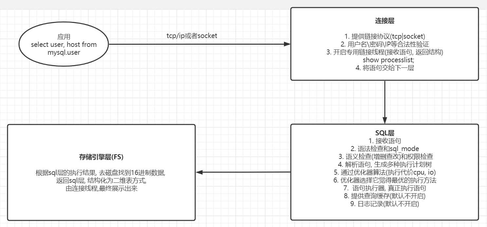

# mysql基础

## mysqld处理sql过程



## mysql逻辑存储结构

```shell
库 表 列(字段) 数据行(记录)

表属性 列属性
```

## mysql物理存储结构

```shell
myisam
    user.frm 存储表结构(列, 列属性)
    user.MYD 存储数据记录
    user.MYI 存储索引

innodb
    time_zone.frm 存储表结构(列, 列属性)
    time_zone.ibd 存储数据记录
    ibdata1       数据字典信息
```

## innodb段,区, 页

```shell
一般情况下(非分区表)
一个表就是一个段
一个段由多个区构成
一个区由64个连续的页(16k)组成, 1M大小
```

## 字符集和校对规则

```shell
# charset
# GBK: 中文2个字符, utf8: 3, utf8mb4: 4
# utf8mb4: 支持emoji

# collation
# utf8mb4其中两个字符集校对规则
# utf8mb4_general_ci 大小写不敏感
# utf8mb4_bin        大小写敏感
```

## 用户和权限管理

### 用户

```sql
-- 用户 用户名@'白名单'

-- 新建用户
create user crab@'10.0.0.%' identified by '123';

-- 8.0之前, 同时新建和授权
grant all on *.* to crab@'10.0.0.%' identified by '123';

-- 查询用户
select user,host from mysql.user;

-- 修改密码
alter user crab@'10.0.0.%' identified by '12345';

-- 删除用户
drop user crab@'10.0.0.%';
```

### 权限

```sql
-- with grant option 是否可以给别人授权
-- grant 权限 on 作用目标 to 用户 identified by 密码 with grant option;

-- 创建一个用户ww, 通过10网段对ww库下的所有表进行select, insert, update, delete
grant select, insert, update, delete on ww.* to ww@'10.0.0.%' identified by '123';

-- 查询权限
show grants for ww@'10.0.0.%';
-- GRANT USAGE ON *.* TO 'ww'@'10.0.0.%'    可登陆
-- GRANT SELECT, INSERT, UPDATE, DELETE ON `ww`.* TO 'ww'@'10.0.0.%'

-- 回收权限
revoke delete on ww.* from 'ww'@'10.0.0.%';
```

## 数据类型

```shell
# 整数
tinyint
int

# 字符串
char(100)       未占满使用空格填充
varchar(100)    255字符内单独申请一个字符长度的空间储存字符长度,超过则申请2个, 100个字符(中文,数字,英文)
enum            枚举

# 时间
datetime
timestamp
```

## 结构化语句

常用SQL分类

```shell
DDL 数据定义语言 create alter
DCL 数据控制语言 grant revoke
DML 数据操作语言 insert update delete
DQL 数据查询语言 select show
```

### DDL 数据库定义

```sql
-- 创建数据库
create database if not exists test charset 'utf8mb4';

--查看
show databases;
show databases test;

-- 删除数据库
drop database test;

-- 修改数据库字符集
alter database test charset utf8mb4;
```

数据库定义规范

```shell
库名小写
库名不能数字开头
库名不能是数据库内部关键字
必须设置字符集
```

### DDL 表定义

```sql
-- 创建表
--CREATE TABLE [IF NOT EXISTS] tbl_name(
--字段名称 字段类型 [UNSIGNED|ZEROFILL] [NOT NULL] [DEFAULT 默认值] [[PRIMARY] KEY| UNIQUE [KEY]] [AUTO_INCREMENT]
--)ENGINE=INNODB CHARSET=UTF8 AUTO_INCREMENT=1;

-- 表名小写,不能数值开头,不能是保留关键字
-- 选择合适的数据类型和长度
-- 不能为空, not null default, 要有注释
-- 必须设置存储引擎和字符集
-- 主键自增
-- emun只保存字符串类型

create table if not exists user(
    id smallint unsigned primary key auto_increment,
    username varchar(20) not null unique,
    password char(32) not null,
    age tinyint unsigned default 18,
    sex enum('男','女','保密') default '保密',
    email varchar(50) not null,
    addr varchar(200),
    birth year,
    salary float(8,2),
    tel int,
    married tinyint comment '0未婚,非0已婚',
    reg_time int unsigned,
    face char(100) not null default 'default.jpg'
) engine=innodb charset='utf8mb4';

-- 查看表定义
show create table user;

-- 删除表
drop table user;

-- 重命名表
alter table user rename to user1;
rename table user1 to user;

-- 复制表结果
create table testt like test;
```

#### 表结构修改

```sql
-- 添加字段
alter table user add test1 varchar(100) not null after username;

-- 删除字段
alter table user drop test1;

-- 修改字段属性
alter table user modify email varchar(100) not null;

-- 修改字段名称
alter table user change email eml varchar(100) not null;

-- 删除默认值
alter table user alter age drop default;

-- 修改自增长值
alter table user auto_increment=100;

-- 删除主键
alter table user modify id smallint unsigned;
alter table user drop primary key;

-- 添加主键
alter table user add primary key(id);

-- 外键,先添加联合主键,然后添加外键
ALTER TABLE gd_uniprot ADD CONSTRAINT pk_re PRIMARY KEY(disease_id, gene_id);
ALTER TABLE gd_uniprot ADD CONSTRAINT fk_dis FOREIGN KEY(disease_id) REFERENCES disease_uniprot(id);
ALTER TABLE gd_uniprot ADD CONSTRAINT fk_ge FOREIGN KEY(gene_id) REFERENCES gene_primary_uniprot(id);

-- 修改表的储存引擎为myisam
alter table user engine=myisam;

-- 在线改表结构
-- pt-osc
```

### DML 插入,更新,删除

```sql
-- 插入数据
create table if not exists user(
    id smallint unsigned primary key auto_increment,
    username varchar(20) not null unique,
    password char(32) not null,
    email varchar(50) not null,
    age tinyint unsigned default 18
) engine=innodb charset='utf8mb4';

insert into user values(1, '1', '1', '1@qq.com', 20);

insert into user set id=102, username='2', password='2', email='2@qq.com';

insert user(username, password, email) VALUES('3','3', '3@qq.com'),
('4','4', '4@qq.com');

-- 将查询结果插入到表中
create table test(
    id tinyint  primary key auto_increment,
    username varchar(20));

insert test select id, username from user;

-- 插入数据，唯一键已存在则更新
insert into _cs_disease_map(dis_id, gene_symbol) VALUES('2857', "A1BG")  on DUPLICATE key update source = CONCAT(source, ',abc');

-- 更新数据
update user set age=5;

-- 删除数据
delete from user where id=1;

-- 清空表, 自增值重置, delete * 自增值不变
truncate table user;
```

### DQL 查询

#### 单表

```sql
-- 查询系统参数
select @@version;

-- 查询表中记录age值为NULL
select * from cms_user where age is null;

-- 查询编号在3~10之间的用户
select * from cms_user where id between 3 and 10;

-- 查询proId为1和3的用户
select * from cms_user where proid in (1,3);

-- 查询姓张的用户
select * from cms_user where username like '张%';

-- 查询用户名为3位的用户
select * from cms_user where username like '___';

-- 去重
select DISTINCT gene_symbol FROM _cs_disease_map;

-- 先按照省份分组,再按照性别分组
select group_concat(username),proid,sex from cms_user group by proid, sex;

--COUNT(字段)不统计NULL值
select count(age) from cms_user;

-- 查询编号,性别,用户名详情,组中总人数,组中最大年龄,最小年龄,
-- 平均年龄,以及年龄总和按照性别分组
-- 编号大于等于4的用户
select id,sex,group_concat(username), count(*),
max(age), min(age), avg(age), sum(age)
from cms_user
where id>=4
group by sex
having count(*)>2 and max(age)>60
order by sex asc, id desc;

-- 实现记录随机
select * from cms_user order by rand();

-- 查询前五条记录
select * from cms_user limit 5;

-- 查询从第二条开始一共五条记录
select * from cms_user limit 2,5;

-- 按照id降序排列，更新前3条
update cms_user set age=age+10 order by id desc limit 3;

-- 联合查询
select username from employee union select username from cms_user;

-- union all不会过滤重复数据, union会
select id, username from employee union all select username,sex from cms_user;

-- 语句中查询条件 or in 一般用uniion改写
-- select * from city where code='chn' or code = 'usa';
select * from city where code='chn' union all select * from city where code='usa';

-- 查询用户名以t开始的用户
select * from cms_user where username regexp '^t';

-- concat
update cms_user set email=concat('email_', email);

-- group_concat
select group_concat(name) from cms_user group by dp;

-- TRIM
SELECT CONCAT('_',TRIM(' ABC '),'_'),CONCAT('_',LTRIM(' ABC '),'_'),CONCAT('_',RTRIM(' ABC '),'_');
```

#### 多表连接查询

```sql
-- 内连接
-- 查询cms_user表中id,username,email,sex
-- 查询provinces表proName
-- 条件是cms_user的性别为男的用户
-- 根据proName分组
-- 对分组结果进行筛选,选出组中人数>1的
select u.id,group_concat(u.username),u.email,u.sex, p.proname
from cms_user as u
inner join provinces as p on
p.id=u.proid
where u.sex='男'
group by p.proname
having count(*)>1;

-- 左外连接
select u.id,u.username,u.email,u.sex, p.proname
from cms_user as u
left join provinces as p on
p.id=u.proid;

-- 右外连接
select u.id,u.username,u.email,u.sex, p.proname
from cms_user as u
right join provinces as p on
p.id=u.proid;

-- 子查询
select id,username from employee where depid in (select id from department);

-- exists
select id,username from employee where exists(select id from department where id=4);
select id,username from employee where not exists(select id from department where id=4);

-- 查询获得1等奖学金的学员
select username,score from student where score >=(select level from scholarship where id=1);

-- 查询所有获得奖学金的学员
select username,score from student where score >=any(select level from scholarship);
select username,score from student where score >=some(select level from scholarship);

-- 查询所有学员中获得一等奖学金的学员
select username,score from student where score >=all(select level from scholarship);

-- 查询学员表中没有获得奖学金的学员
select username,score from student where score <all(select level from scholarship);
```

#### 字符串分割

```sql
select SUBSTRING_INDEX(image_true_path, 'dx') from img_overlap_result limit 10;
```

### DQL show

```sql
-- 查看mysql编码
show variables like '%char%';

-- 只对当前连接有效
set names 'utf8';

-- 查看warning信息
show warnings;

-- 查看会话变量
show session variables;

-- 更改会话变量,仅针对当前会话
set autocommit='off';
set @@session.autocommit='on';

-- 查看全局变量
show global variables;
select @@global.autocommit;

-- 更改全局变量
set global autocommit='on';
```

## 元数据

```sql
use information_schema;

-- 显示所有库和表的信息
select table_schema, group_concat(table_name)
from information_schema.tables
group by table_schema;

-- 查询所有innodb引擎的表
select  table_schema, table_name, engine
from information_schema.tables
where engine='innodb';

-- 统计world数据库数据量大小
select table_schema, sum((avg_row_length*table_rows+index_length))/1/24
from information_schema.tables
where table_schema='world';
```

## 索引

索引树高度越低越好, 一般维持在3-4最佳

### Btree索引功能上的分类

```shell
辅助索引
提取索引列的所有值进行排序
将排好序的值均匀存放在叶子节点, 进一步生成枝节点和根节点
在叶子节点中的值, 都会对应存储主键ID

聚集索引
MYSQL会自动选择主键作为聚集索引列, 没有主键则唯一键, 都没有则生成隐藏的
mysql储存数据时, 会按照聚集索引列值的顺序, 有序存储数据行
聚集索引直接将原表数据页作为叶子节点, 然后提取聚集索引列向上生成枝和根
```

### 区别

```shell
表中任何一个列都可以创建辅助索引
一张表中, 聚集索引只能有一个,一般是主键
辅助索引的叶子节点只存储索引列的有序值+聚集索引列值
聚集索引的叶子节点存储的是有序的整行数据
mysql的表数据存储是聚集索引组织表
```

### 辅助索引细分

```shell
单列辅助索引
联合索引(覆盖索引)
唯一索引
```

```sql
-- 查看索引
show index from cms_user;

-- 删除索引
drop index in_id on test4;

-- 创建普通索引
CREATE TABLE test4(
id TINYINT UNSIGNED,
username VARCHAR(20),
INDEX in_id(id),
KEY in_username(username)
);

create index in_id on test4(id);
alter table test4 add index in_id(id);

-- 唯一索引
create unique index in_id on test4(id);

-- 全文索引,innodb也可
create fulltext index full_username on test4(username);

-- 多列索引
create index mul_t1_t2_t3 on test8(test1,test2,test3);

-- 前缀索引, 仅字符串, 前5个字符
alter table city add index idx_dis(district(5));

-- 空间索引,仅myisam
CREATE TABLE test10(
id TINYINT UNSIGNED AUTO_INCREMENT KEY,
test GEOMETRY NOT NULL,
SPATIAL INDEX spa_test(test)
)ENGINE=MyISAM;

create spatial index spa_test on test10(test);
```

### 联合索引

```shell
add index idx(a,b,cd)
# 唯一值多的列放在最左侧

# 1. 所有索引列都是等值查询的条件下, 无关排列顺序
# 优化器会自动做查询条件的排列
select * from test where a=1 and b=1 and c=1 and d=1

# 2. 不走全部索引的情况
cda ---> a
dba ---> ab

```

### 索引应用规范

```shell
建立索引原则
1. 必须有主键
2. 经常作为where条件列, order by group by join on, distinct的条件
3. 使用唯一值多的列作为联合索引前导列
4. 列值长度较长, 使用前缀索引
5. 降低索引条目, 不创建无用索引, 清理不常使用索引, percona toolkit(xxxx)
6. 索引维护避开业务繁忙期
7. 小表不建索引

不走索引的情况
1. 无查询条件, 或查询条件没有建立索引
2. 查询结果集是原表中的大部分数据, 应该是25%以上(针对辅助索引)
3. 索引本身失效, 统计数据不真实
4. 查询条件使用函数在索引列上, 或者对索引列进行运算(+-*/)
5. 隐式转换导致索引失效
6. <>, not in 不走索引(针对辅助索引)
7. like '%sd%' 不走索引
8. 联合索引应用不对的情况


对于辅助索引来说, != 和 not in, 等语句是不走索引的
对于主键索引来说, != 和 not in, 等语句走的是range

like '%sd%' 不走索引
like 'sd%' 走索引
```

## 执行计划

```shell
# 执行计划获取的是优化器认为代价最小的执行计划
# 作用: 语句执行前,先看执行计划信息,可以有效的防止性能较差的语句带来的性能问题
# 如果业务中出现了慢语句,也需要借助此命令进行语句的评估,分析优化方案

# desc select * from test;
# explain select * from test;
```

### 执行计划分析

```shell
mysql> mysql> desc select user, host from mysql.user;
+----+-------------+-------+------------+-------+---------------+---------+---------+------+------+----------+-------------+
| id | select_type | table | partitions | type  | possible_keys | key     | key_len | ref  | rows | filtered | Extra       |
+----+-------------+-------+------------+-------+---------------+---------+---------+------+------+----------+-------------+
|  1 | SIMPLE      | user  | NULL       | index | NULL          | PRIMARY | 276     | NULL |    3 |   100.00 | Using index |
+----+-------------+-------+------------+-------+---------------+---------+---------+------+------+----------+-------------+
1 row in set, 1 warning (0.00 sec)


table           表名
type            类型
possible_keys   可能走得索引
key             最终走得索引
key_len         索引覆盖长度, 判断是否走全了索引
Extra           Using Filesort, 说明在查询中有关排序的条件列没有应用索引
```

#### type

```shell
1. 全表扫描    all

# 从左到右, 依次性能最好
2. 索引扫描    index, range, ref, eq_ref, const(system), NULL

index 全索引扫描
# select id from city;

range 索引范围扫描 <>=, between, and, or, in, like
# select * from city where id>20;

ref 辅助索引等值查询
select * from city where code='CHN';

eq_ref 多表连接时, 子表使用主键列或唯一列作为连接
# b.y
# a join b on a.x=b.y

const(system) 主键或者唯一键的等值查询

null 找不到数据
```

## 储存引擎

### InnoDB存储引擎

优点

```shell
事务(Transaction)
MVCC(Multi-Version Concurrency Control多版本并发控制)
行级锁(Row-level Lock)
ACSR(Auto Crash Safey Recovery)自动的故障安全恢复
支持热备份(Hot Backup)
Replication: Group Commit, GTID (Global Transaction ID), 多线程(Multi-Threads-SQL )
```

### 存储引擎查看

```sql
show engine;

SELECT @@default_storage_engine;

-- 会话级别
set default_storage_engine=myisam;

-- 全局级别(仅影响新会话):
set global default_storage_engine=myisam;

-- 重启之后,所有参数均失效.如果要永久生效,写入配置文件
-- 一般先全局修改, 然后写入文件, 下次重启读入配置文件生效
-- vim /etc/my.cnf
-- [mysqld]
-- default_storage_engine=myisam

-- 存储引擎是表级别的,每个表创建时可以指定不同的存储引擎,建议统一为innodb

-- INFORMATION_SCHEMA确认每个表的存储引擎
select table_schema,table_name ,engine from information_schema.tables where table_schema not in ('sys','mysql','information_schema','performance_schema');

-- 修改一个表的存储引擎
alter table t1 engine innodb;
-- 此命令经常用于进行innodb表的碎片整理

-- 批量修改一个库的存储引擎
select concat("alter table zabbix.",table_name," engine tokudb;") from
information_schema.tables where table_schema='zabbix' into outfile '/tmp/tokudb.sql';
```

### InnoDB存储引擎物理存储结构

```shell
ibdata1:共享表空间, 存储系统数据字典信息(统计信息),UNDO表空间等数据
ib_logfile0 ~ ib_logfile1: REDO日志文件,事务日志文件
ibtmp1: 临时表空间磁盘位置,存储临时表
frm:存储表的列信息
ibd:表的数据行和索引
```

## 表空间(Tablespace)

### 共享表空间

```shell
# ibdata1~n, 系统数据字典信息(统计信息),UNDO表空间等数据

# 5.5版本出现的管理模式,也是默认的管理模式, 所有数据存储到同一个表空间中,管理混乱
# 5.6版本,共享表空间只用来存储数据字典信息,undo,临时表
# 5.7版本,临时表独立出去
# 8.0版本,undo独立出去

# select @@innodb_data_file_path;

# 可以在初始化时设置
# 两个文件,不够自动增长
mysqld --initialize --user=mysql ... innodb_data_file_path=ibdata1:512M:ibdata2:512M:autoextend

# 查看自动增长值大小
# show variables like '%extend%';

```

### 独立表空间

```shell
从5.6,默认表空间替换为独立表空间
主要存储用户数据
存储特点为:一个表一个ibd文件,存储数据行和索引信息
基本表结构元数据存储:xxx.frm
表统计数据还是在ibdata1

一张innodb表=frm+ibd+ibdata1

select @@innodb_file_per_table;
1 为独立表空间, 0为共享表空间
```

#### 独立表空间迁移

```shell
1. 创建和原表结构一样的空表
2. 将空表的ibd文件删除
    # alter table city dicard tablespace;
3. 拷贝ibd文件,修改权限
4. 导入ibd文件
    # alter table city import tablespace;
```

## 事务

```shell
Transaction
事务是数据库并发控制的基本单位
事务可以看做是一系列SQL语句的集合
事务必须要么全部执行成功,要么全部执行失败(回滚)
```

### ACID是事务的四个基本特性

```shell
原子性(Atomic)      所有语句作为一个单元全部成功或者取消, 不能出现中间状态
一致性(Consistent)  如果数据库在事务开始时处于一致状态,则在执行事务期间将保留一致状态
隔离性(Isolated)    事务之间互不影响
持久性(Durable)     事务结束之后,修改是永久的不会丢失
```

### 事务的生命周期

```shell
begin;

DML: insert, update, delete

commit;

# 回滚
rollback;

# 自动提交机制
select @@autocommit;
```

#### 触发隐式提交

```shell
# 触发隐式提交
begin; select begin;

以下语句会触发隐式提交, 在事务中自动提交

DDL(later, create, drop)
DCL(grant, revoke, set password)
锁定语句(lock tables, unlock table)
```

### 四种事务隔离级别

如果不对事务进行并发控制,可能会产生四种异常情况

```shell
脏读(dirty read)                一个事务读取到另一个事务没有提交的修改
非重复读(nonrepeatable read)    一个事务重复读两次得到不同结果(会话1更新某条数据, 导致会话2查询此条数据两次结果不一样)
幻读(phantom read)              一个事务第二次查出现第一次没有的结果(会话1更新id>2数据, 会话2插入数据, 导致会话1查询并非所有id>2数据都修改)
丢失修改(lost update)           并发写入造成其中一些修改丢失
```

```shell
select @@tx_isolation;

RU: 读未提交(read uncommitted), 别的事物可以读取到未提交改变, 脏读
RC: 读已提交(read committed), 只能读取已经提交的数据, 可防止脏读, 可能会出现幻读
RR: 可重复读(repeatable read), 同一个事务先后查询结果一样(Mysql innodb默认), 有可能出现幻读, 可利用undo的快照技术和GAP(间隙锁)+NextLock(下键锁)避免(必须是索引)
SR: 串行化(Serializable), 事务完全串行化的执行,隔离级别最高, 防止死锁, 并发性能最差

# 修改隔离级别, 配置文件写入
[mysqld]
transaction_isolation=read uncommitted
```

### 事务ACID特性

一些定义

```shell
ibd
# 存储数据行和索引

buffer pool
# 缓冲区池,数据和索引的缓冲

LSN
# 日志序列号
# 存在于这四个文件, 磁盘数据页(ibd), redo文件(iblogfile0), buffer pool, redo buffer

WAL write ahead log
# 日志优先写的方式实现持久化, 日志优先于数据写入磁盘

脏页
# 内存脏页,内存中发生了修改,没写入到磁盘之前,我们把内存页称之为脏页

CKPT Checkpoint
# 检查点,就是将脏页刷写到磁盘的动作

TXID
# 事务号,InnoDB会为每一个事务生成一个事务号,伴随着整个事务
```

#### redo log

```shell
保证事务的 d(ac)

# 重做日志, 默认50M, 轮训使用, 记录了内存数据页的变化
iblogfile0 iblogfile1

# redo内存区域:数据页的变化信息+数据页当时的LSN号
redo log buffer

作用:
1. 记录内存数据页变化
2. 提供快速达额持久化功能(WAL)
3. CSR过程中实现前滚操作(使磁盘数据页和redo日志LSN一致)

redo刷写策略
commit;
刷新当前事务的redo buffer到磁盘
同时将redo buffer中没有提交的事务日志也刷新到磁盘
```

##### redo的刷新策略

```shell
commit;
刷新当前事务的redo buffer到磁盘
还会顺便将一部分redo buffer中没有提交的事务日志也刷新到磁盘
```

#### undo 回滚日志

```shell
保证事务的 a(ic)

1. 记录了数据修改之前的状态
2. 在rollback时,将内存的数据恢复到修改之前的状态
3. 在CSR中实现将未提交的数据回滚操作
4. 实现一致性快照, 配合锁机制保证MVCC, 读写操作不会互相阻塞
```

#### CSR: 前滚

```shell
MySQL 在启动时,必须保证redo日志文件和数据文件LSN必须一致,如果不一致就会触发CSR,最终保证一致

一个事务,begin;update;commit

1. begin时,会立即分配一个TXID=tx_01

2. update时,会将需要修改的数据页(dp_01,LSN=101),加载到data buffer中

3. DBWR线程,会进行dp_01数据页修改更新,并更新LSN=102

4. LOGBWR日志写线程,会将dp_01数据页的变化+LSN+TXID存储到redobuffer

5. 执行commit时,LGWR日志写线程会将redobuffer信息写入redolog日志文件中
基于WAL原则,在日志完全写入磁盘后,commit命令才执行成功,(会将此日志打上commit标记)

6. 假如此时宕机,内存脏页没有来得及写入磁盘,内存数据全部丢失

7. MySQL再次重启时,必须要redolog和磁盘数据页的LSN是一致的
但是,此时dp_01,TXID=tx_01磁盘是LSN=101,dp_01,TXID=tx_01,redolog中LSN=102

MySQL此时无法正常启动,MySQL触发CSR.在内存追平LSN号,触发ckpt,将内存数据页更新到磁盘,从而保证磁盘数据页和redolog LSN一至.这时MySQL正常启动

以上的工作过程,我们把它称之为基于REDO的"前滚操作"
```

#### 锁

```shell
实现了事务间的隔离功能

innodb实现了行级锁
```

## 存储过程

```sql
-- 临时变量
use cms;
delimiter $$;
create procedure test1()
begin
declare a int default 10;
select a;
end
$$;
delimiter ;
call test1();
-- 10

-- in:输入参数
use cms;
delimiter $$;
create procedure test_int(in in_int int)
begin
select in_int;
set in_int=10;
select in_int;
end
$$;
delimiter ;
set @in_int=1;
call test_int(@in_int);
-- 1
-- 10

select @in_int;
-- 1

-- out:输出参数
use cms;
delimiter $$;
create procedure test_out(out in_out int)
begin
select in_out;
set in_out=10;
select in_out;
end
$$;
delimiter ;
set @in_out=1;
call test_out(@in_out);
-- null
-- 10

select @in_out;
-- 10

-- inout:输入输出参数
use cms;
delimiter $$;
create procedure test_in_out(inout in_out int)
begin
select in_out;
set in_out=10;
select in_out;
end
$$;
delimiter ;
set @in_out=1;
call test_in_out(@in_out);
-- 1
-- 10

select @in_out;
-- 10

-- 查看数据库下的存储过程
show procedure status where db='cms';

-- 查看存储过程的内容
show create procedure test10;

-- 删除存储过程
drop procedure test_in_out;
```

## 流程控制

```sql
-- if else
use cms
delimiter $$;
create procedure test_if(in age int)
begin
if age>60 then
select '老年人';
elseif age>18 then
select '成年人';
else
select '未成年';
end if;
end
$$;
delimiter ;
set @age=70;
call test_if(@age);

-- case
select id, username, score,
case when score>=90 then '很好'
when score>70 then '不错'
when score>55 then '合格'
else '不合格'
end
from student;

-- ifnull
select ifnull(null, 2);
-- 2
select ifnull(1,2);
-- 1

-- while
use cms;
delimiter $$;
create procedure test_while()
begin
declare i int default 1;
declare s int default 0;
while i<=100 do
set s=s+i;
set i=i+1;
end while;
select s;
end
$$;
delimiter ;
call test_while();
-- 5050


-- 定义条件和处理
delimiter $$;
create procedure test10()
begin
declare continue handler for sqlstate '42S02' set@x=1;
-- 定义条件之后不会报错,继续执行
select * from cms_user1;
select * from cms_user;
end
$$;
delimiter ;
call test10();
```

## 函数

```sql
-- 查看是否开启创建函数功能
show variables like '%fun%';

-- 开启创建函数功能
set global log_bin_trust_function_creators=1;

-- 创建函数
delimiter $$;
create function test_add(a int, b int)
returns int
begin
return a+b;
end
$$;
delimiter ;
select test_add(3,4);

-- 查看函数创建内容
show create function test_add;

-- 查看数据库下的函数
show function status;

-- 删除函数
drop function if exists test_add;
```

## 视图

```sql
create or replace view v_test
as
select * from cms_user where id>3;
select * from v_test;

-- 视图是表的查询结果,表的数据改变,视图的结果也会改变
update cms_user set age=100 where id=4;
select * from v_test;

-- 视图的增删改也会影响表
update v_test set age=83 where id=5;
select * from cms_user;

-- 查看数据库视图列表
select table_schema,table_name from information_schema.views;

-- 查看视图信息
show table status from cms like 'v%';

-- 查看删除视图权限
select drop_priv from mysql.user where user='root';

-- 删除视图
drop view if exists v_test;
```

## 触发器

```sql
-- cms_user表数据更新时,省份表的省份名称更改为user表的相应用户名
delimiter $$;
create trigger tr_test after update
on cms_user for each row
begin
    update provinces set proName=old.username where id=old.id;
end
$$;
delimiter ;

update cms_user set age=10 where id=2;

-- 查看所有触发器
show triggers;

-- 查看触发器
select * from information_schema.triggers where trigger_name='tr_test';

-- 删除触发器
drop trigger tr_test;
```

## My ISAM表锁

```sql
-- 共享读锁,当前session可读不可写,不可读其他未锁的表,其他session可读,写的时候会等待释放锁，可以读其他表
lock table cms_user read;
select * from cms_user;
update cms_user set age=10 where id=1;
-- ERROR 1099 (HY000): Table 'cms_user' was locked with a READ lock and can't be updated
select * from cms_admin;
-- ERROR 1100 (HY000): Table 'cms_admin' was not locked with LOCK TABLES
unlock tables;

-- 查看表锁状态
show status like '%lock%';

-- 独占写锁,当前session可读可写,不可读其他未锁的表,其他session等待释放锁之后才可读写，可以读其他表
lock table cms_user write;
select * from cms_user;
update cms_user set age=20 where id=1;
select * from cms_admin;
-- ERROR 1100 (HY000): Table 'cms_admin' was not locked with LOCK TABLES
unlock tables;

-- 并发插入

-- 查看并发插入,0不允许并发插入,1无空洞(无删除的行)可插入,2都允许插入
-- 当前读锁的session获取不到另一个session的插入,释放锁之后才可以获取到
show variables like '%concurrent_insert%';

-- 设置并发插入
set global concurrent_insert=2;
```

## 慢查询

```sql
-- 慢查询
show variables like '%long_query_time%';

-- 查看数据库运行时间
show status like 'uptime';
-- 查看当前select数
show status like 'com_select';
-- 查看当前连接数
show status like 'connections';
show status like 'slow_quries';

-- 查看表的状态
show table status like 'cms_user';
```

## 分区

```sql
show variables like '%part%';
```

## 用户,权限管理

```sql
-- 创建用户,可远程访问
create user abc@'%' identified by 'sdgsdgr'
-- 只能本地访问
create user abc@'localhost' identified by 'sdgsdgr';

-- 修改用户密码
alter use abc@'%' identified by '456';

-- 删除用户
drop user abc@'%';

-- 用户授权,同时创建用户(5.6版本)
GRANT ALL PRIVILEGES ON gene_disease.* TO bmnars@"%" IDENTIFIED BY "vi93nwYV";

-- with grant option 超级管理员才具备的,给别的用户授权的功能
-- 8.0版本的授权,必须先创建用户
GRANT ALL PRIVILEGES ON my_blog.* TO 7JTZsiuI@'localhost';
```

本地管理员用户密码忘记,重置密码操作

```sql
[root@db01 ~]# mysqld_safe --skip-grant-tables --skip-networking &
mysql> flush privileges;
mysql>  alter user root@'localhost' identified by '123456';
[root@db01 ~]# pkill mysqld
[root@db01 ~]# systemctl start  mysqld
```

## show语句

```sql
-- 查看用户的权限信息
show  grants for  root@'localhost'

-- 查看字符集
show charset；

-- 查看校对规则
show collation

-- 查看数据库连接情况
show processlist;

-- 表的索引情况
show index from tables;

-- 模糊查询数据库某些状态
SHOW STATUS LIKE '%lock%';
;
-- 查看支持的所有的存储引擎
show engines;

-- 查看InnoDB引擎相关的状态信息
show engine innodb status\G;
```

## 日期时间函数

```sql
-- 返回当前日期和时间
select now();

-- 返回当前日期
select curdate();

-- 返回当前时间
select curtime();

-- 日期转换为天数
select to_days('1995-08-01');

-- 查询年龄
select (to_days(curdate())-to_days('1995-08-01'))/365;

-- 查询月份
select month(curdate());

-- 查询月份名字
select monthname(curdate());

-- 返回星期几,0表示星期一
select weekday(curdate());

-- 返回星期几的名称
select dayname(curdate());

-- 返回一周内的第几天,1是星期天
select dayofweek(curdate());

-- 星期一
select dayofweek('2020-01-06');
-- 2

-- 一年内的第几个星期
select week(curdate());
```

### 日期格式化

```sql
-- 2019-02-22 17:06:12
date_format(receiving_time, '%Y-%m')
-- 2019-02
```

### 排名

```sql
-- 按各科成绩进行行排序,并显示排名,Score重复时合并名次
select *, dense_rank() over (partition by cid order by score desc) as 排名 from sc;
-- row_number() 1 2 3 4
-- dense_rank() 1 2 2 3
-- rank() 1 2 2 4
```
