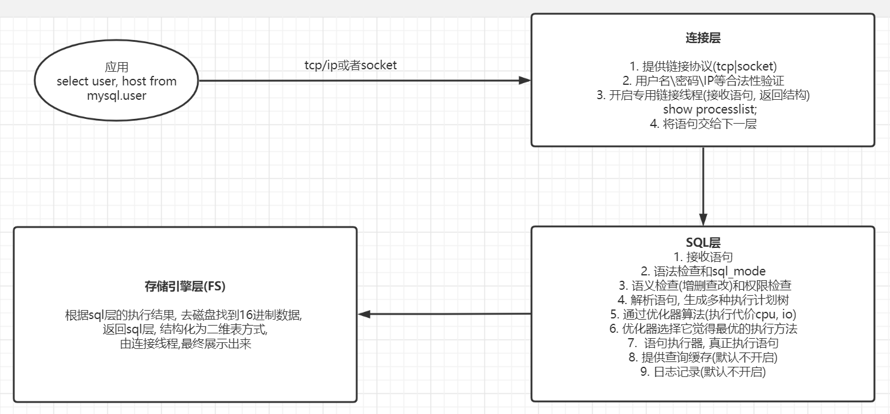

# MySQL安装及管理

## MySQL安装

### win 10安装mysql

安装（bin目录)

```shell
mysqld install
net start mysql
```

删除

```shell
net stop mysql
mysqld remove
```

my.ini(安装目录)

```shell
[mysql]
# 设置mysql客户端默认字符集
default-character-set=utf8
[mysqld]
#设置3306端口
port = 3306
# 设置mysql的安装目录
basedir=D:\program\program_database\mysql-8.0.13-winx64
# 设置mysql数据库的数据的存放目录
datadir=D:\program\program_database\mysqldata
# 允许最大连接数
max_connections=200
# 服务端使用的字符集默认为8比特编码的latin1字符集
character-set-server=utf8
# 创建新表时将使用的默认存储引擎
default-storage-engine=INNODB
# mysql导入导出数据的路径，空表示任意
secure_file_priv = ''
```

添加环境变量

```shell
D:\program\program_database\mysql-8.0.13-winx64\bin
```

#### mysql服务无法启动

```shell
mysqld --console

# 删除自己手动创建的data文件夹
mysqld -remove
# 自动创建了data文件夹以及相关的文件
mysqld --initialize-insecure
mysqld install
net start mysql
```

### Centos7安装mysql-5.7.26

```shell
# 下载
wget https://downloads.mysql.com/archives/get/p/23/file/mysql-5.7.26-linux-glibc2.12-x86_64.tar.gz

# 解压
tar -zxvf mysql-5.7.26-linux-glibc2.12-x86_64.tar.gz

# 移动
mv mysql-5.7.26-linux-glibc2.12-x86_64 /application/mysql5726

# 软件部分 /application/mysql5726
# 数据部分 /data/mysql5726/data

# 卸载默认安装的mariadb
yum remove mariadb.x86_64

# 建立mysql用户和组
useradd -s /sbin/nologin mysql5726

# 配置环境变量
# vim /etc/profile
# export PATH=/application/mysql5726/bin:$PATH
source /etc/profile

# 授权
chown -R mysql5726.mysql5726 /application/*
chown -R mysql5726.mysql5726 /data

mkdir -p /data/mysql5726/data/
# 初始化(创建系统数据), 方式1
mysqld --initialize --user=mysql5726 --basedir=/application/mysql5726 --datadir=/data/mysql5726/data
# 生成临时密码, 180天过期

# 初始化方式2(无密码方式)
# mysqld --initialize-insecure --user=mysql5726 --basedir=/application/mysql5726 --datadir=/data/mysql5726/data

# 报错安装依赖
yum install -y libaio-devel

# 配置文件
cat > /etc/mysql5726.cnf <<EOF
[mysqld]
user=mysql5726
basedir=/application/mysql5726
datadir=/data/mysql5726/data
socket=/tmp/mysql.sock
server_id=5726
port=5726

[mysql]
socket=/tmp/mysql.sock
EOF

# centos 6 启动mysql
# cp /application/mysql5726/support-files/mysql.server /etc/init.d/mysqld
# servive msqld start

# centos 7 启动mysql
cat > /etc/systemd/system/mysqld5726.service <<EOF
[Unit]
Description=MySQL Server
Documentation=man:mysqld(8)
Documentation=http://dev.mysql.com/doc/refman/en/using-systemd.html
After=network.target
After=syslog.target
[Install]
WantedBy=multi-user.target
[Service]
User=mysql5726
Group=mysql5726
ExecStart=/application/mysql5726/bin/mysqld --defaults-file=/etc/mysql5726.cnf
LimitNOFILE = 5000
EOF

# 启动
systemctl start mysqld5726.service

# 设置初始密码
mysqladmin -uroot -p password root
```

### mysql启动关闭

```shell
# 1. 日常启动
mysql.server start ---> mysqld_safe ---> mysqld
mysql.service                       ---> mysqld
# 都依赖/etc/my.cnf启动

# 2. 维护性任务
mysqld_safe --skip-grant-tables
# 同样读取/etc/my.cnf, 参数冲突命令行优先
# 关闭
mysqladmin -uroot -p 123 shutdown
```

### 密码重置(忘记密码)

```shell
# 1. 关闭数据库库
/etc/init.d/mysqld stop

# 2. 维护模式启动数据库
mysqld_safe --skip-grant-tables --skip-networking &

# 3. 登录数据库修改密码
mysql> flush privileges;
mysql> alter user root@'localhost' identified by 'roott';

# 4. 关闭数据库, 正常启动
pkill mysqld
systemctl start  mysqld


# 在mysql5.7.26, centos7以上方法测试不成功, 通过写入配置方式
# 1. 配置文件添加
[mysqld]
skip-grant-tables

# 2. 重启mysql, 输入mysql进入数据库

# 3. 登录数据库修改密码
mysql> flush privileges;
mysql> alter user root@'localhost' identified by 'roott';

# 删除添加的配置, 正常启动mysql
```

### 一些错误

caching-sha2-password

```sql
# Navicat连接 Mysql 8.0.11 出现1251- Client does not support authentication protocol 错误解决方法一样

# root用户登陆,修改加密规则
ALTER USER 'root'@'localhost' IDENTIFIED BY 'root' PASSWORD EXPIRE NEVER;
# 更新一下用户的密码
ALTER USER 'root'@'localhost' IDENTIFIED WITH mysql_native_password BY 'root';
# 刷新权限
FLUSH PRIVILEGES;
alter user 'root'@'localhost' identified by 'root';
# 重启mysql服务
mysqld restart
```

Incorrect integer value: '' for column 'id' at row 1

```shell
mysql 5以上的版本如果是空值应该要写NULL或者0(int类型),或者:
1. 安装mysql的时候去除默认勾选的enable strict SQL mode
2. 更改mysql中的配置,重启mysql

sql-mode="STRICT_TRANS_TABLES,NO_AUTO_CREATE_USER,NO_ENGINE_SUBSTITUTION"
# 修改为
sql-mode="NO_AUTO_CREATE_USER,NO_ENGINE_SUBSTITUTION"，
```

RROR 1290 (HY000): The MySQL server is running with the --secure-file-priv option so it cannot execute this statement

```shell
# mysql默认对导入导出的目录有权限限制,使用命令行进行导入导出时需在指定目录操作

# 查询mysql 的secure_file_priv值配置
show global variables like '%secure%';

# 更改mysql配置,重启
# 空表示无限制,null表示不允许
secure-file-priv=''
```

ONLY_FULL_GROUP_BY报错

```shell
# 填入查询的结果(去掉ONLY_FULL_GROUP_BY),重启mysql
vim /etc/my.cnf
sql_mode='STRICT_TRANS_TABLES,NO_ZERO_IN_DATE,NO_ZERO_DATE,ERROR_FOR_DIVISION_BY_ZERO,NO_ENGINE_SUBSTITUTION'
```

### 初始化配置

#### 标签归类

```shell
# 服务器端
[mysqld]
[mysqld_safe]
# 包括上面两个
[server]

# 客户端
[mysql]
[mysqladmin]
[mysqldump]
# 包括上面3个
[client]
```

#### 基础配置

```shell
[mysqld]
# 用户
user=mysql5726
# 软件安装目录
basedir=/application/mysql5726
# 数据存放目录
datadir=/data/mysql5726/data
# socket文件位置
socket=/tmp/mysql.sock
# 服务器ID, 1-65535
server_id=5726
port=5726

[mysql]
# 与服务器一致
socket=/tmp/mysql.sock
```

## mysql基础定义

### 结构化查询语句

常用SQL分类

```shell
DDL:数据定义语言 create alter
DCL:数据控制语言 grant revoke
DML:数据操作语言 insert update delete
DQL:数据查询语言 show select
```

### mysqld处理sql过程



### mysql逻辑存储结构

```shell
库 表 列(字段) 数据行(记录)

表属性 列属性
```

### mysql物理存储结构

```shell
myisam
    user.frm 存储表结构(列, 列属性)
    user.MYD 存储数据记录
    user.MYI 存储索引

innodb
    time_zone.frm 存储表结构(列, 列属性)
    time_zone.ibd 存储数据记录
    ibdata1       数据字典信息
```

### innodb段,区, 页

```shell
一般情况下(非分区表)
一个表就是一个段
一个段由多个区构成
一个区由64个连续的页(16k)组成, 1M大小
```

## 用户和权限管理

### 用户

```sql
-- 用户 用户名@'白名单'

-- 新建用户
create user crab@'10.0.0.%' identified by '123';

-- 8.0之前, 同时新建和授权
grant all on *.* to crab@'10.0.0.%' identified by '123';

-- 查询用户
select user,host from mysql.user;

-- 修改密码
alter user crab@'10.0.0.%' identified by '12345';

-- 删除用户
drop user crab@'10.0.0.%';
```

### 权限

```sql
-- with grant option 是否可以给别人授权
-- grant 权限 on 作用目标 to 用户 identified by 密码 with grant option;

-- 创建一个用户ww, 通过10网段对ww库下的所有表进行select, insert, update, delete
grant select, insert, update, delete on ww.* to ww@'10.0.0.%' identified by '123';

-- 查询权限
show grants for ww@'10.0.0.%';
-- GRANT USAGE ON *.* TO 'ww'@'10.0.0.%'    可登陆
-- GRANT SELECT, INSERT, UPDATE, DELETE ON `ww`.* TO 'ww'@'10.0.0.%'

-- 回收权限
revoke delete on ww.* from 'ww'@'10.0.0.%';
```
